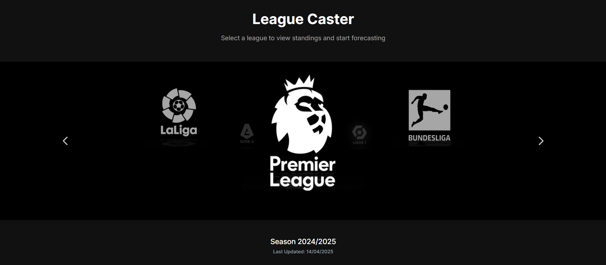

# [League Caster](https://league-caster.vercel.app/)

> **League Caster** is a sophisticated web application built with Next.js that allows football enthusiasts to predict outcomes across Europe's top five leagues (Premier League, La Liga, Bundesliga, Serie A, and Ligue 1). Using real-time data from the official football data API, users can simulate match results, visualize dynamic table updates, and forecast end-of-season standings, making it an essential tool for football analytics and entertainment.

<div align="center">
  
</div>

---

## ✨ Key Features:

- **Multi-League Support:** Forecast matches across the five major European football leagues.
- **Real-time Data:** Automatically fetches current standings and fixtures via the Football Data API.
- **Interactive Predictions:** Intuitive interface for predicting match outcomes with various options.
- **Dynamic Table Updates:** Watch league standings adjust instantly as you submit your predictions.
- **Responsive Design:** Optimized for all devices with a modern, clean UI using Tailwind CSS.

---

## 🛠 Technical Overview:

- **Framework:** [Next.js 15](https://nextjs.org/) (App Router) with React 19 and TypeScript
- **UI/Styling:** [Tailwind CSS 4](https://tailwindcss.com/) for responsive design
- **API Integration:** [Football-Data.org API](https://www.football-data.org/) with Axios
- **Hosting:** Deployed on [Vercel](https://vercel.com/) for optimal Next.js performance
- **Caching:** Client-side caching implementation to reduce API calls
- **Data Processing:** Real-time standings calculation based on user predictions

---

## 🚀 Getting Started

### Installation

1. Clone the repository:
   ```bash
   git clone https://github.com/yourusername/league-caster.git
   ```

2. Navigate into the repository directory:
   ```bash
   cd league-caster
   ```

3. Install dependencies:
   ```bash
   npm install
   ```

4. Create a `.env.local` file with your API key:
   ```
   API_KEY='your_football_data_api_key'
   ```
   You can obtain an API key from [Football-Data.org](https://www.football-data.org/client/register).

### Running Locally

```bash
npm run dev
```

Open [http://localhost:3000](http://localhost:3000) to view the application.

---

## ⚽ Usage

1. **Select a League:** Choose from the five major European leagues on the home screen.
2. **View Current Standings:** See the current league table based on real-time data.
3. **Start Forecasting:** Click the "Start Forecasting" button to begin predicting matches.
4. **Make Predictions:**
   - Each match defaults to a draw
   - Select "Home" or "Away" for a team win
   - Use custom scoring for specific score predictions
5. **Submit Predictions:** Click "Submit Predictions" to calculate new standings.
6. **Continue Through Season:** The app progresses through each matchday, allowing you to forecast the entire season.
7. **View Standings:** Toggle between current and predicted standings at any time.

---

## 🌐 Deployment

League Caster is deployed on Vercel. Experience the live application at [https://league-caster.vercel.app/](https://league-caster.vercel.app/).

---

## 🧠 Advanced Features

- **Rate Limiting Protection:** The application implements smart request queuing and exponential backoff to handle API rate limits.
- **Caching Strategy:** Implements local storage caching to minimize API requests and improve performance.
- **Error Recovery:** Multiple fallback mechanisms for handling API failures or timeouts.